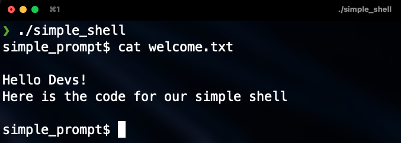

# Simple Shell

## Description

This project focuses on creating a shell, whirch is a command interpreter program for unix-based operating systems.
The shell allows the user to communicate with the operating system interactively through the commands that the user enters.
Its function is to read the command line, interpret its meaning, carry out the command, and then output the result via the outputs.
To carry out this project, the c language was used.

## Files

| Name | Description |
| ------------------------------ | -------------------------------------------- |
| AUTHORS | Contributors in this repository.|
| man_1_simple_shell | Manual of simple_shell. |
| shell.h | Header file program. |
| main.c | Main function, interactive and non-interactive. |
| new_procees.c | Function that creates a new process. |
| own_cd.c | Change the working directory. |
| own_env.c | Function that prints environment variables. |
| own_exit.c | Exit shell with a given state. |
| own_help.c | Function that prints help (get information about a command) |
| read_line.c | Read a line from stdin. |
| read_stream.c | Read a line from the stream. |
| shell_interactive.c | Run shell interactive mode. |
| shell_non_interactive.c | Run shell non-interactive mode. |
| split_line.c | Split a string into tokens. |
| execute_args.c | Number of builtin functions. |

## List of functions and system calls.

* chdir (man 2 chdir)
* exit (man 3 exit)
* fork (man 2 fork)
* free (man 3 free)
* getline (man 3 getline)
* isatty (man 3 isatty)
* malloc (man 3 malloc)
* perror (man 3 perror)
* strtok (man 3 strtok)
* waitpid (man 2 waitpid)

## Requeriments

All your files will be compiled on Ubuntu 20.04 LTS using gcc, using the options -Wall -Werror -Wextra -pedantic -std=gnu89

## Install

Clone the repository https://github.com/santiagobedoa/simple_shell.git

Compile gcc -Wall -Werror -Wextra -pedantic -std=gnu89 *.c -o hsh

## Usage

Interactive mode: ./hsh

Non-interactive mode: echo "/bin/ls" | ./hsh

### Built-ins

* [x] cd
* [x] env
* [x] help
* [x] exit

### Examples

Run shell in interactive mode:

```
 $ ./hsh
 simple_prompt$ ls -l
 total 84
-rw-r--r--. 1 alejandrouran alejandrouran   867 abr 20 15:36 execute_args.c
-rwxr-xr-x. 1 alejandrouran alejandrouran 25720 abr 20 15:36 hsh
-rw-r--r--. 1 alejandrouran alejandrouran   241 abr 20 15:36 main.c
-rw-r--r--. 1 alejandrouran alejandrouran   645 abr 20 15:36 new_process.c
-rw-r--r--. 1 alejandrouran alejandrouran   383 abr 20 15:36 own_cd.c
-rw-r--r--. 1 alejandrouran alejandrouran   316 abr 20 15:36 own_env.c
-rw-r--r--. 1 alejandrouran alejandrouran   284 abr 20 15:36 own_exit.c
-rw-r--r--. 1 alejandrouran alejandrouran   499 abr 20 15:36 own_help.c
drwxr-xr-x. 2 alejandrouran alejandrouran  4096 abr 20 15:36 prueba
-rw-r--r--. 1 alejandrouran alejandrouran   579 abr 20 15:36 read_line.c
-rw-r--r--. 1 alejandrouran alejandrouran   800 abr 20 15:36 read_stream.c
-rw-r--r--. 1 alejandrouran alejandrouran   701 abr 20 15:36 shell.h
-rw-r--r--. 1 alejandrouran alejandrouran   504 abr 20 15:36 shell_interactive.c
-rw-r--r--. 1 alejandrouran alejandrouran   364 abr 20 15:36 shell_non_interactive.c
-rw-r--r--. 1 alejandrouran alejandrouran   783 abr 20 15:36 split_line.c
```
```
 $ ./hsh
 simple_prompt$ pwd
 /home/alejandrouran/Documentos/simple_shell
```
```
 $ /hsh
 simple_prompt$ echo “Hello, World!”
 “Hello, World!”
```
Run shell in non-interactive mode:

```
 $ echo "/bin/ls" | ./hsh
 execute_args.c own_cd.c    prueba     shell_interactive.c
 hsh     own_env.c   read_line.c    shell_non_interactive.c
 main.c      own_exit.c  read_stream.c  split_line.c
 new_process.c   own_help.c  shell.h
```
```
 $ echo "pwd" | ./hsh
 /home/alejandrouran/Documentos/simple_shell
```
## Authors

<a href = 'https://www.github.com/Crisgrva'> </a> [@alejuran](https://github.com/alejuran) | [@santiagobedoa](https://github.com/santiagobedoa)

<a href = 'https://www.twitter.com/crisgrvc'> </a> [@alejuran](https://twitter.com/alejuran) | [@santiagobedoa](https://twitter.com/santiagobedoa)
